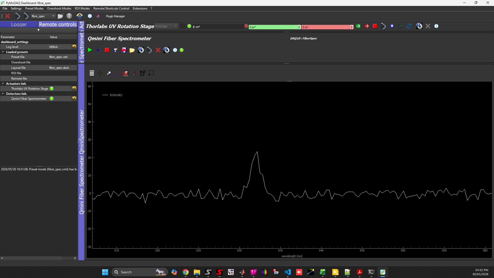
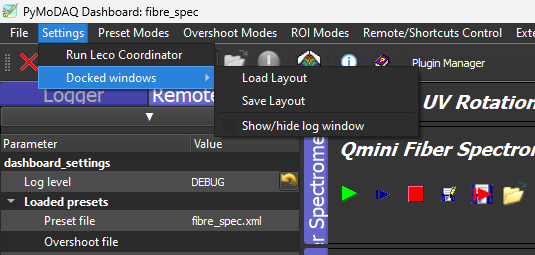
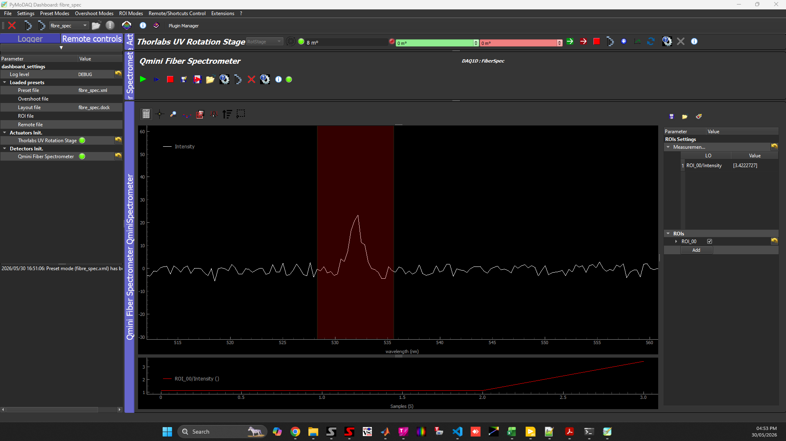
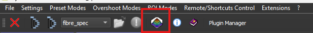
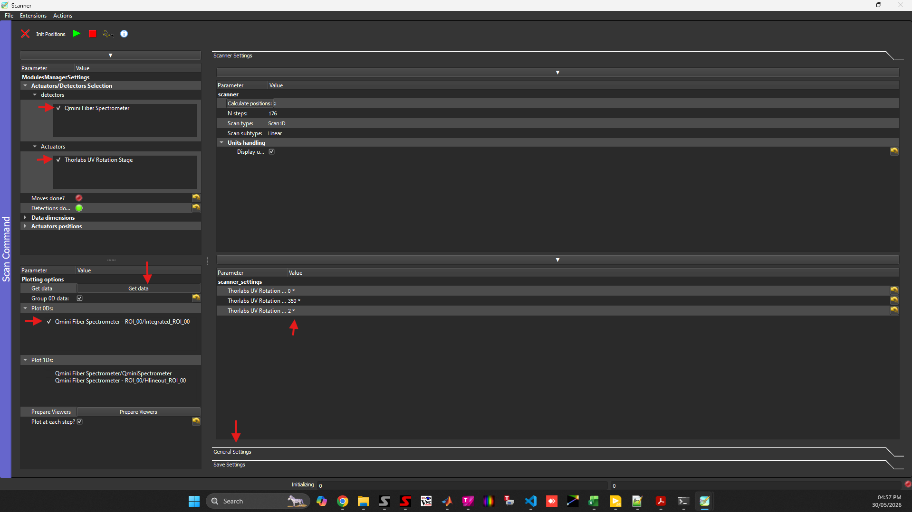
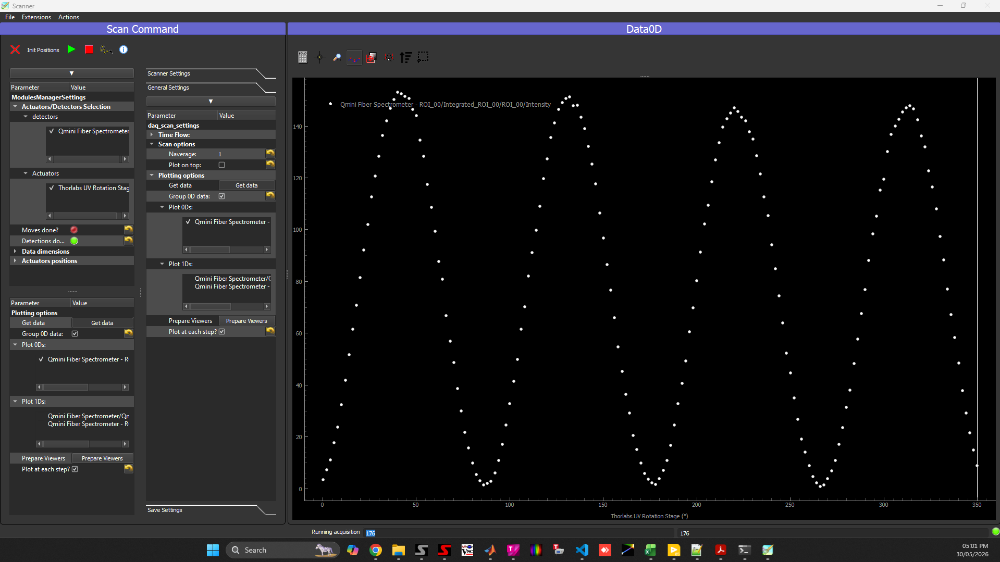
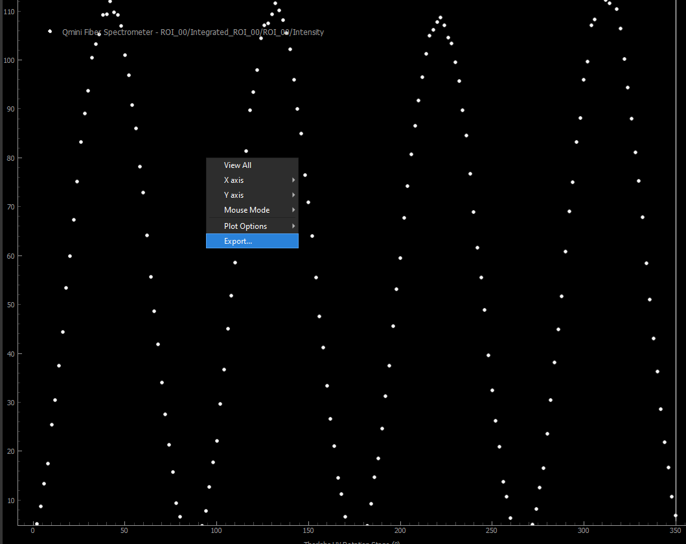
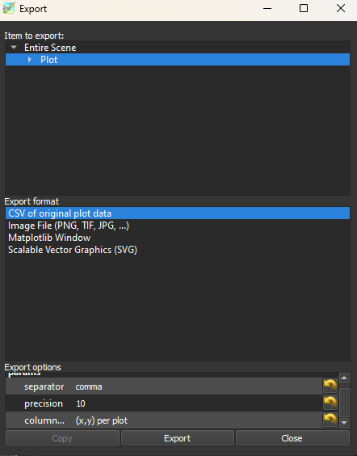
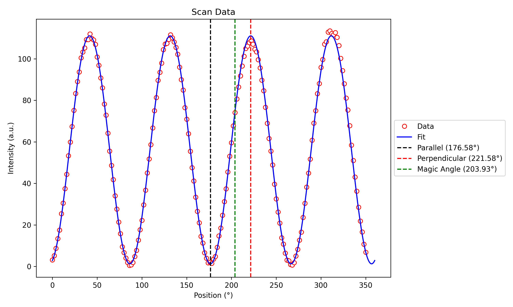

# Pymodaq Rotation Stage Test

We made a venv (python 3.11) with miniforge (mamba). To activate the venv use:

`mamba activate pymodaq_rot_env`

in the miniforge shell. All scripts can be found on `Desktop/Other Programs/pymodaq_test`. 

## Thorlabs Rotation Stage

For our rotation stage there is no plugin. Hence we need to write our own plugin. For this we can clone 
the pymodaq_template_repo:

`git clone https://github.com/PyMoDAQ/pymodaq_plugins_template.git`

To control the rotation stage we will use the `thorlabs-elliptec` package:

`pip install thorlabs-elliptec`

The interfacing of the thorlabs stage was very straight-forward and the code to interface it is located at `scr/hardware/RotStage.py` and its implementation in
pymodaq is at `daq_move_plugins/daq_move_RotStage.py`.

## Qmini RGBLasersystems Fiber Spectrometer

To interface the qmini rgblasersystems USB mini spectrometer we had to download the SDK here: "https://docs.broadcom.com/docs/12398530" 
We then copied the provided `RgbDriverKit.dll` to the `hardware` directory within the pymodaq plugin. In addition the dowload of the `Waves` software form the provider is required to operate the spectrometer. This software can be dowloaded free of charge from the provider website following the link: "https://docs.broadcom.com/docs/12398529" which will install the required drivers to communicate with the spectrometer.

The SDK exposes the spectrometer API through a .NET assembly (`RgbDriverKit.dll`). A .NET assembly is a compiled software library containing reusable classes and methods that can be called from any .NET-compatible language such as C#, MATLAB, or Python.

To access the DLL methods from Python, we translated the vendor-provided MATLAB example into Python using the `pythonnet` library.

`pip install pythonnet`

`pythonnet` provides interoperability between Python and the Microsoft .NET runtime, allowing Python code to directly load .NET assemblies and call their classes and methods. Using AI we have translated the vendor provided MATLAB example into python.

The code to interface the the QminiSpectrometer is located at `scr/hardware/fiberspec.py` and its implementation in pymodaq is at `daq_viewer_plugins/plugins_1D/daq_1Dviwer_FiberSpec.py`.

## Putting Both Together in the Dashboard

For this we opened the `dashboard` and created a new "preset" called `fibre_spec.xml`. With the rotation stage and the spectrometer both as master.
You can conveniently load the prest directly via:

`dashboard -p fibre_spec`

Afterwards you should be greeted by:

  

In there you can now read out the spectrometer and control the rotation stage. You can also move around the docks to your liking. Once you moved them to something you like you can save the layout and load it later via: 

  

## Performing a DAQ Scan

Next, we would like to do a scan of the fiber spectrometer intensity against the rotation stage angle. In the later scan we would like to analyze the integrated intensity over a certain region. For this you can conveniently define a *region of interest (ROI)* in the spectrometer plot using the *calculator symbol*: 

  

after simply press on *ROI: add* in the bottom right corner. 

Now to perform the scan we need to open the *Daq Scan* extension: 

  

The 3D plot symbol. This will open a dialog where you can define what you want to scan against each other: 

  

Several things have to be done to configure a scan (see red arrows).

1. First you have to define the actuators and detectors in the scan. For us we simply check the tickbox next to the "Fiber Spectrometer" Detector and the "Rotation Stage" Actuator. 

2. Next you should press on the *get data* button. Afterwards all plotable things will be listed. Here we would like to only plot the ROI agains the rotation stage angle. Therefore, we simply untick all the other plots except the *Plot0Ds: ROI ...*. 

3. Now you can set the parameters of the scan, i.e. the start and stop angle as well as the step size under *scanner settings*. If you'd like to add averaging of multiple scans, you can do it under the *general settings* dialog. 

4. The data of each scan will always be saved as a *.h5* file under the path specified in the *save settings* dialog. 

5. To start the scan, simply press the play button. 

After one full scan we got for example: 

  

## Exporting the saved Data

The data of the scan can simply be exported by right-clicking on the plot region (still in the DAQ scan extension) and selecting *export* : 

  

You can then choose to export the data as a .csv file:

  

The exported data can then conveniently be analyzed by custom python scripts, e.g. 

`python plot_scan_data.py`

  